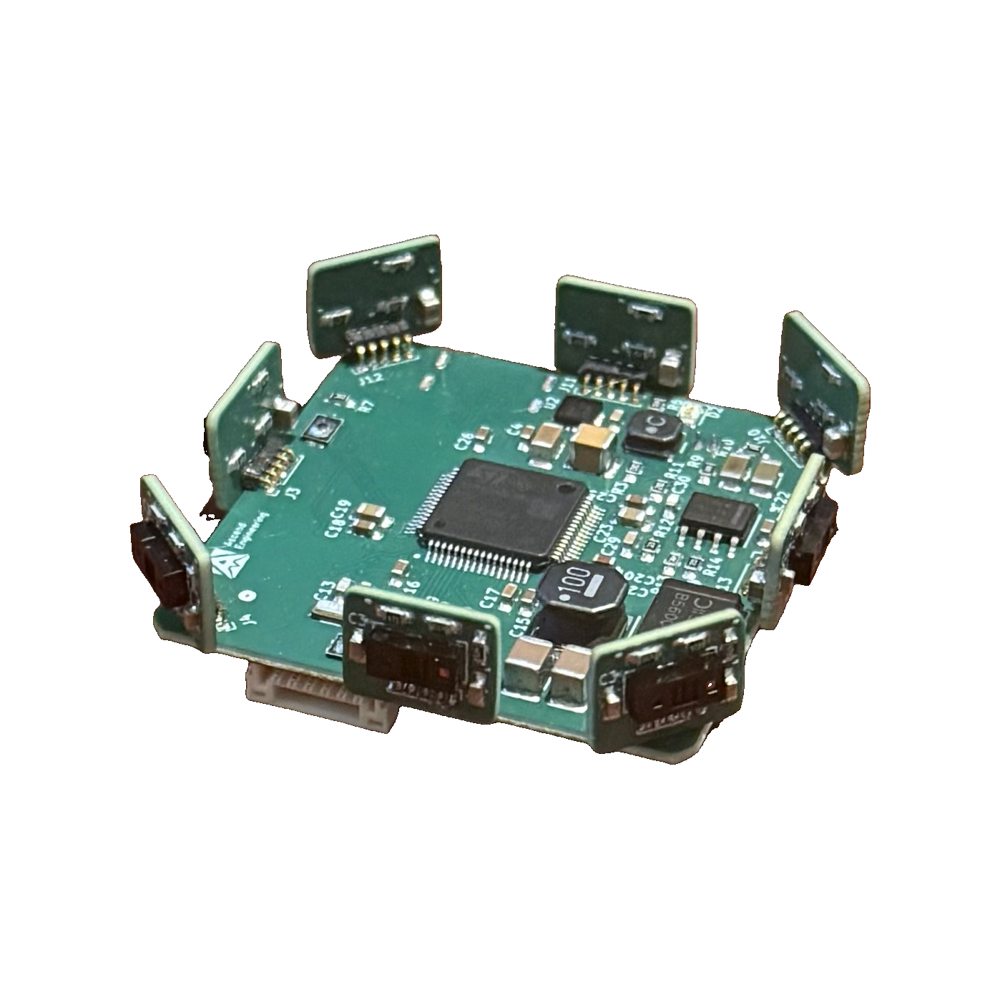

# Hardware overview

<figure markdown="span">
  { width="340" }
  <figcaption>Assembled Ascend-8tof, main board with the 8 vertical TOF sub-boards forming the 360° ring</figcaption>
</figure>

The Ascend-8tof is a **360° time-of-flight obstacle-sensing system** made of two
board types:

1. **Main / carrier board**. An **STM32H5-family MCU** with onboard power
   regulation, a USB-C port, a host UART, and eight sensor connectors.
2. **TOF sub-board (×8)**. One small board per channel carrying a single
   **VL53L8CX** 8×8 multizone time-of-flight sensor. Up to 8 plug into the main
   board to form the 360° ring.

See [Power](02-power.md) for supply and current limits and
[Communications](03-comms-protocol.md) for the UART output the board produces.

## Sensor at a glance

| Property | Value |
|----------|-------|
| Sensor | VL53L8CX multizone ToF |
| Zones per sensor | **8 × 8** (64 zones) |
| Sensors per board | up to **8** (360° coverage) |
| Update rate | **15 Hz** per sensor |
| Reliable range | **~4 m** (8×8 mode) |
| Per-sensor field of view | ~45° per axis |

## Connectors & pinouts

Everything an integrator needs is on three externally relevant connectors plus the
eight sensor ports.

| Connector | Purpose | Notes |
|-----------|---------|-------|
| **Power in** (`J1`) | External DC input | 2-pin. See [Power](02-power.md) for the voltage and current range |
| **USB-C** (`J2`) | Power + USB | Alternative to `J1` for bench use |
| **Host UART** (`J7`) | Data/telemetry out | 4-pin. This is how you talk to the board |
| **Sensor ports** (`J3 to J6`, `J10 to J13`) | TOF sub-boards | 8× 5-pin, one per channel |

### Host UART connector (`J7`): 4-pin

This is the board's interface to your flight controller or onboard computer.

| Pin | Signal |
|-----|--------|
| 1 | +5 V (power input, you can power the board from here) |
| 2 | RX (into board) |
| 3 | **TX (out of board)**, connect to your host's RX |
| 4 | GND |

Wire **pin 3 (board TX) → host RX** and **pin 4 → host GND**. See
[Communications](03-comms-protocol.md) for the data format and
[Integration](05-integration.md) for host wiring.

### Sensor connector (×8): 5-pin

All eight sensor ports are identical 5-pin connectors:

| Pin | Signal |
|-----|--------|
| 1 | Sensor supply (high) |
| 2 | Sensor supply (low) |
| 3 | SCL |
| 4 | SDA |
| 5 | GND |

Each port maps to a fixed **channel number**, which fixes that sensor's
bearing in software:

| Connector | Channel | Connector | Channel |
|-----------|---------|-----------|---------|
| **J6** | CH0 | **J12** | CH4 |
| **J5** | CH1 | **J13** | CH5 |
| **J4** | CH2 | **J10** | CH6 |
| **J3** | CH3 | **J11** | CH7 |

## Dimensions & weight

| Item | Size |
|------|------|
| **Main / carrier board** | **40 × 40 mm** |
| **TOF sub-board** (each) | **11.4 × 8.8 mm** |
| **Assembled footprint** | 40 × 40 mm |
| **Assembled height** | **~10 mm** (the sub-boards stand vertically around the perimeter) |
| Weight | *to be confirmed* |

## Mechanical / mounting

- Mount the board flat on top of the flight-control unit (FCU) with **CH3 (J3)
  facing the vehicle nose**. The eight sensors then look outward in ~45°
  increments to form a 360° ring.
- See the bearing table in
  [Integration → Extrinsics](05-integration.md#extrinsics-etcmodalaiextrinsicsconf)
  for the per-channel directions.
- Sensors sit close to the FCU center, so mounting translation is negligible at
  meter-scale mapping (rotations are what matter).
