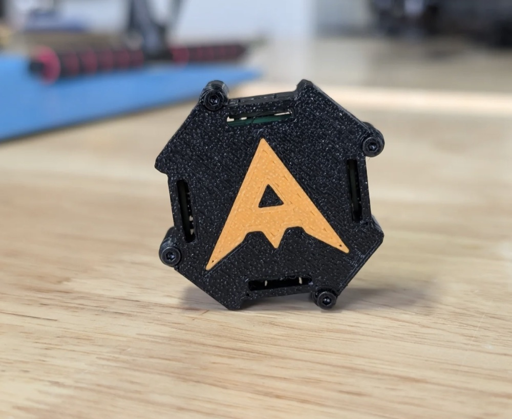
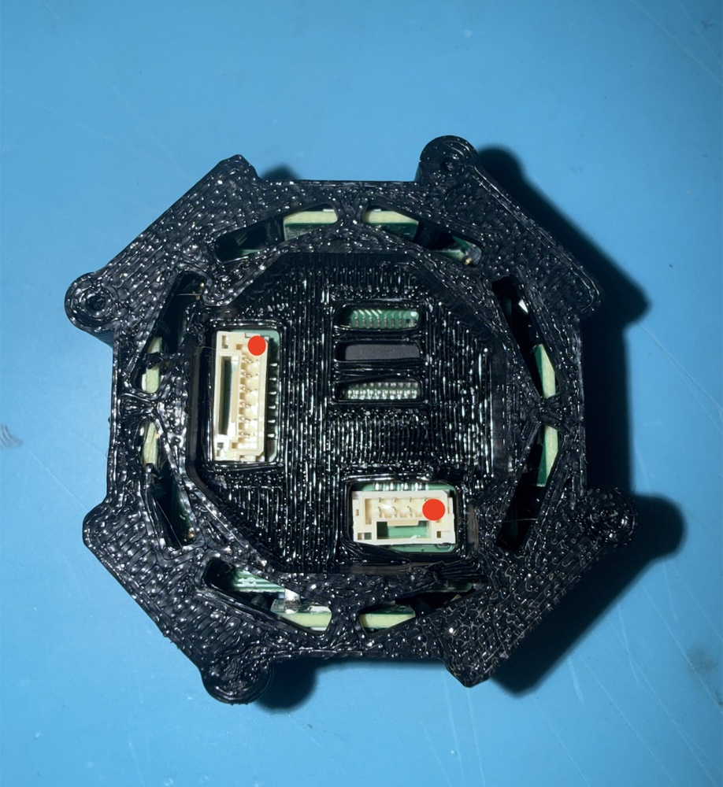

# Hardware Overview

<figure markdown="span">
  { width="420" }
  <figcaption>Assembled Ascend-8tof v2. The tip of the <strong>A</strong> marks the
  nose — the sensor behind the slot beneath it is <strong>CH7 (J8)</strong>.
  Each of the eight faces carries one VL53L8CX looking outward.</figcaption>
</figure>

The Ascend-8tof v2 is a **360° time-of-flight obstacle-sensing system** built from
two board types:

1. **Main / carrier board** — `oa_pcb_STM32H5_horizontal`, a 30 × 30 mm board
   carrying an **STM32H563RGT6**, a **TCA9548A** I²C multiplexer, onboard power
   regulation, a host UART and a SWD port.
2. **TOF sub-board (×8)** — one per channel, carrying a single **VL53L8CX** 8×8
   multizone ToF sensor. Eight plug into the main board to form the ring.

## Sensor at a glance

| Property | Value |
|----------|-------|
| Sensor | VL53L8CX multizone ToF |
| Zones per sensor | **8 × 8** (64 zones) |
| Sensors per board | **8** (360° coverage) |
| Ranging rate | **15 Hz** per sensor |
| Reliable range | **~4 m** (8×8 mode) |
| Per-sensor field of view | ~45° per axis |

## Connectors & pinouts

Two externally-relevant connectors plus the eight sensor ports. **There is no
USB-C on v2** — `PA11`/`PA12` are unrouted, so all host traffic goes over `J5`.

| Connector | Type | Purpose |
|-----------|------|---------|
| **`J5`** | JST GH 1.25 mm, 4-pin (SM04B-GHS-TB) | Power in **and** host UART |
| **`J6`** | JST GH 1.25 mm, 6-pin (SM06B-GHS-TB) | SWD — flashing and debug |
| **`J1`–`J4`, `J7`–`J10`** | 1.00 mm pin header, 1×05 | TOF sub-boards, one per channel |

<figure markdown="span">
  { width="440" }
  <figcaption>The two JST connectors, seen from the underside.
  <strong>J6</strong> (6-pin, upper left) and <strong>J5</strong> (4-pin, lower
  right). The <span style="color:#d33">red dots</span> mark the <strong>supply
  pin on each</strong> — <code>J5</code> pin 1 (<strong>VIN, 5 V</strong>) and
  <code>J6</code> pin 6 (+3V3). Use them to orient a cable before plugging it
  in: they are at opposite ends of the two connectors.</figcaption>
</figure>

**Power goes into `J5`** — the 4-pin connector, on the pin marked red. `J6` is
SWD; its +3V3 pin is a probe reference, not a way to power the board.

### `J5` — power + host UART

This single connector is both how you power the board and how you talk to it.

| Pin | Signal | Direction | Notes |
|-----|--------|-----------|-------|
| 1 | **VIN** | in | **5 V only** — see [Power](02-power.md) before wiring this |
| 2 | **RX** (`PA3`) | in | from your host's TX |
| 3 | **TX** (`PA2`) | out | to your host's RX |
| 4 | **GND** | — | must be common with the host |

!!! danger "Pin 1 is a regulated 5 V input, not a battery input"
    `J5` pin 1 feeds a 3.3 V LDO whose absolute maximum input is **6 V**, with no
    overvoltage protection in front of it. Anything above ~5.5 V risks destroying
    the board. See [Power](02-power.md).

### `J6` — SWD

| Pin | Signal |
|-----|--------|
| 1 | GND |
| 2 | SWO |
| 3 | SWDIO |
| 4 | SWCLK |
| 5 | NRST |
| 6 | +3V3 |

Used for flashing firmware and for the SWD-readable diagnostics described in
[Bring-up & Setup](06-bringup-setup.md).

### Sensor connectors (×8) — 1.00 mm, 5-pin

All eight are identical. The sub-board's two supplies are generated on the
carrier board; you never provide them yourself.

| Pin | Signal |
|-----|--------|
| 1 | +3V3 |
| 2 | +1V8 |
| 3 | SCL |
| 4 | SDA |
| 5 | GND |

Each connector is wired to one fixed TCA9548A channel, which fixes that
sensor's bearing in firmware:

| Channel | Connector | Bearing (CW from nose) | Direction |
|---------|-----------|------------------------|-----------|
| **CH7** | **`J8`** | **0°** | **FRONT / nose** |
| CH0 | `J4` | 45° | front-right |
| CH1 | `J3` | 90° | right |
| CH2 | `J2` | 135° | back-right |
| CH3 | `J1` | 180° | back |
| CH4 | `J9` | 225° | back-left |
| CH5 | `J10` | 270° | left |
| CH6 | `J7` | 315° | front-left |

!!! note "How the mapping is verified"
    The table above is confirmed two independent ways: the connector centroids in
    the PCB place the eight at 45° steps in the clockwise order
    `J8, J4, J3, J2, J1, J9, J10, J7`, and the TCA9548A netlist assigns its
    channel pin-pairs in the order `J4, J3, J2, J1, J9, J10, J7, J8` = CH0..CH7.
    Both agree with the physical build.

    Firmware's `tof8_sensor_bearing_deg[]` in `src/obstacle_avoidance.c` is the
    single source of truth — the browser configurator is served these exact
    values in its `INFO` message, so there is no second copy to keep in sync.

## Block diagram

```
                    ┌──────────────── carrier board (30 × 30 mm) ───────────────┐
   J5.1 VIN ──► D2 ─┼─► +5V ─► U3 ─► +3V3 ─┬─► IC1  STM32H563RGT6              │
   (5 V)      SS14  │        TLV75733      ├─► U2   TCA9548A ──┬── CH0  J4      │
                    │                      │                    ├── CH1  J3      │
   J5.2/3 UART ─────┼──── PA3 / PA2 ───────┘                    ├── ...          │
   J5.4 GND         │                                           └── CH7  J8 nose │
                    │        +3V3 ─► U1 ─► +1V8 ─► sensor pin 2                 │
   J6 SWD ──────────┼─────── TPS62130                                            │
                    └───────────────────────────────────────────────────────────┘
```

`IC1` reaches every sensor through `U2` on one I²C bus (`PB6` = SCL, `PB7` = SDA,
pulled up by `R2`/`R3`). Only one channel is connected at a time.

!!! note "U2's RESET is not under firmware control"
    `U2` pin 3 (`RESET`) connects only to pull-up `R6` — it is **not** wired to a
    GPIO. Firmware therefore cannot reset the multiplexer, and a channel
    selection can only be cleared by a **power cycle**. This matters when
    diagnosing a jammed bus; see
    [Bring-up → A sensor that jams the bus](06-bringup-setup.md#a-sensor-that-jams-the-bus).

## Dimensions & weight

| Item | Size |
|------|------|
| **Carrier board** | **30 × 30 mm** |
| **TOF sub-board** (each) | **8 × 7 mm** |
| **Assembled weight** (in case) | **15 g** |
| **Bare PCB weight** | **~9 g** |

## Mechanical / mounting

- Mount the unit flat, with the **tip of the "A" on the case lid facing the
  vehicle nose**. That puts **CH7 (`J8`) at 0°**, and the other seven follow
  clockwise at 45° steps.
- Getting this wrong rotates the entire obstacle picture, so confirm it before
  flying: open the [configurator](https://tools.ascendengineer.com), wave a hand
  at the nose, and check that **CH7**'s grid is the one that lights up.
- Sensors sit close to the vehicle centre, so mounting translation is negligible
  at meter-scale avoidance; the rotations are what matter. See
  [Integration](05-integration.md).
