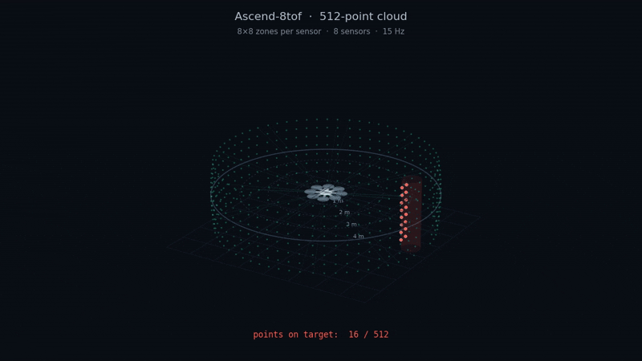

# Ascend-8tof v2 — Overview

{ width="420" }

The Ascend-8tof v2 combines eight VL53L8CX sensors into a fixed, non-spinning
ring of **512 ranging zones**. Connect it to a flight controller or companion
computer over UART, or inspect the live 3D point cloud in Chrome at
[tools.ascendengineer.com](https://tools.ascendengineer.com).

The system uses a **horizontal v3 STM32H563RGT6 carrier with eight v2 sensor
boards**. Power it with **regulated 5 V through J5** and use an FTDI adapter for
the browser connection.

**Current support is limited to collision prevention and raw ToF data.**

## Applications

<table data-view="cards"><thead><tr><th align="center"></th></tr></thead><tbody><tr><td align="center"><h4>Indoor &#x26; GPS-denied</h4>
Inspections and flight inside structures where satellites never reach.
</td></tr><tr><td align="center"><h4>Tunnels &#x26; confined spaces</h4>
Tight, walled environments where wall clearance matters most.
</td></tr><tr><td align="center"><h4>Low-light &#x26; night ops</h4>
No light needed — the sensors carry their own infrared.
</td></tr><tr><td align="center"><h4>Close-proximity work</h4>
Flying near people, equipment, and infrastructure with a safety margin.
</td></tr><tr><td align="center"><h4>Warehouse &#x26; stockpile</h4>
Autonomous scans through racking and around large volumes.
</td></tr><tr><td align="center"><h4>Research &#x26; swarm</h4>
A clean data feed for perception, mapping, and multi-drone work.
</td></tr></tbody></table>

## Point-cloud view

{ width="800" }

The animation illustrates the 512-zone layout. Use the
[setup guide](06-bringup-setup.md) to connect your board and inspect its live
measurements.

## Start here

- [Bring-up and setup](06-bringup-setup.md): power, FTDI wiring, browser connection,
  and a target check on each channel.
- [System documentation](system-documentation.md): hardware, protocols, and integration.
- [Firmware and installer](08-install-firmware.md): **10 Hz / 10 ms with a 10 Hz UART cloud**,
  with [installation verified on two boards](09-firmware-release-notes.md#validation-status).
- [Complete assembly and electronics STEP files](10-case-files.md): CAD downloads
  for the case and electronics, with checksums.

## Specifications

| Specification | Detail |
| --- | --- |
| Ranging zones | Eight 8×8 arrays; 512 zones total |
| Sensor rate | Up to 15 Hz per sensor at 8×8; the current release selects 10 Hz |
| Point-cloud packet rate | Approximately 10 Hz with the current firmware; 9.98 Hz measured on the bench |
| Coverage | Sensors arranged around a 360° ring; unmeasured directions remain unknown |
| Range capability | Up to 4 m under suitable conditions; validate targets, lighting, and profile |
| Resolution | 8×8 zones per sensor; approximately 45° field of view per axis |
| Host connection | J5 UART, 921600 baud, 8N1; MAVLink plus an on-request binary point cloud |
| Power | **Regulated 5 V through J5**; current depends on the profile and load |
| Firmware installation | ST-Link through J6 |
| Forward orientation | Tip of the A on the lid; CH7/J8 |

See [Power](02-power.md) before connecting a supply. The [profile comparison](02-power.md#choosing-a-ranging-profile)
explains exposure timing; range and total board power for this release remain
unmeasured.

## Experimental obstacle-avoidance demonstration

!!! danger "EXPERIMENTAL SOFTWARE — NOT CURRENTLY OFFERED ON THE 8TOF BOARD"
    **The video below demonstrates experimental obstacle-avoidance software
    that is in active development. This software is not currently offered on
    the 8TOF board.**

    **We currently support collision prevention and raw ToF data only.**
    The obstacle-avoidance behavior shown in this video is a development
    demonstration, not a currently supported product feature.

  <iframe src="https://www.loom.com/embed/0985aae7b1264882adabbc66015feb99" title="Ascend 8TOF experimental obstacle-avoidance demonstration" style="position:absolute;top:0;left:0;width:100%;height:100%;border:0;" allowfullscreen loading="lazy"></iframe>

[Watch the experimental demonstration on Loom](https://www.loom.com/share/0985aae7b1264882adabbc66015feb99).

For development background, see the
[experimental setpoint-streaming approach](07-obstacle-avoidance.md). The
downloadable firmware's [validation status](09-firmware-release-notes.md#validation-status)
is recorded separately from this demonstration.
